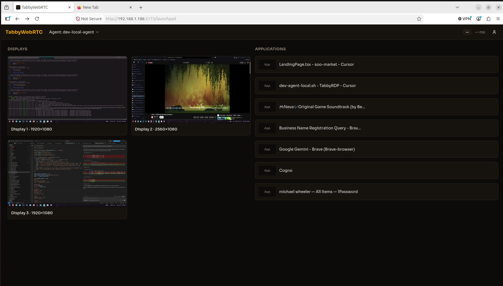

# TabbyWebRTC

Stream your desktop displays and individual application windows to a browser tab over WebRTC — with near-native keyboard and mouse control, mobile-device authentication, and cost-conscious cloud infrastructure.

## What it does

TabbyWebRTC pairs a lightweight **desktop agent** (Rust) with a **browser-based viewer** (React). After you authenticate with your phone, the launchpad shows live thumbnails of each display alongside a scrollable list of capturable apps. Pick a source, open a tab, and interact as if you were sitting at the machine.

- **Display and per-app capture** — stream full monitors or individual application framebuffers
- **Mobile auth key** — sign in and approve sessions from your phone (QR scan + biometric confirm)
- **Launchpad** — two-column UI with display thumbnails (refreshed on connect and every 5 minutes) and an app list
- **Remote input** — keyboard, mouse, scroll, clipboard paste, and system commands (Ctrl+Alt+Del, sleep, restart, shutdown)
- **Source locking** — only one browser tab can stream a given display or app at a time
- **Cross-platform agent** — Windows, macOS, and Linux (Linux is the primary development target)

The desktop agent never changes display settings on the host.

## Preview



## Architecture

| Component | Location | Role |
|---|---|---|
| Desktop agent | `components/desktop-agent/` | Rust service — screen capture, input injection, WebRTC peer |
| Web viewer | `components/frontend/` | React + TypeScript app — auth, launchpad, stream viewer |
| Backend | `components/infra/` | AWS CDK stack — WebSocket signaling, REST auth, TURN credentials, update distribution |
| CI/CD | `.github/workflows/`, `scripts/` | GitHub Actions pipelines and developer tooling |

Signaling and session management run on AWS Lambda with DynamoDB. The static frontend deploys to Cloudflare Pages. Agent installers are distributed via Cloudflare R2 behind the REST API.

## Getting started

### Prerequisites

- Node.js 22+
- Yarn 1.x
- Rust stable toolchain
- AWS CLI v2 (for backend deploy and local SAM)

### Setup

```bash
yarn setup
```

Edit `components/frontend/.env.local` and `components/infra/.env` with your Clerk and AWS values, then start the local stack:

```bash
yarn dev
```

For SAM-based backend signaling instead of the local test server:

```bash
yarn dev:backend    # signaling API on :3001
yarn dev:frontend   # Vite dev server on :5173
```

### Build everything

```bash
yarn build
```

Individual targets:

```bash
yarn build:frontend
yarn build:infra
yarn build:agent
```

### Package the desktop agent (current host platform)

```bash
yarn package:agent
```

Installers are written to `components/desktop-agent/packaged/`.

### Tests

```bash
yarn test
```

## Desktop agent downloads

Latest dev installers are served via the API Gateway REST endpoint after the dev stack is deployed.

| Platform | Latest installer |
|---|---|
| Linux x86_64 | `https://REPLACE_DEV_REST_URL/downloads/linux-x86_64` |
| Linux arm64 | `https://REPLACE_DEV_REST_URL/downloads/linux-aarch64` |
| macOS Intel | `https://REPLACE_DEV_REST_URL/downloads/macos-x86_64` |
| macOS Apple Silicon | `https://REPLACE_DEV_REST_URL/downloads/macos-aarch64` |
| Windows x86_64 | `https://REPLACE_DEV_REST_URL/downloads/windows-x86_64` |

Manifest: `https://REPLACE_DEV_REST_URL/updates/manifest.json`

Replace `REPLACE_DEV_REST_URL` with the `RestEndpoint` CDK output from `TabbyWebRTCDev` after first deploy.

## Project scripts

| Command | Description |
|---|---|
| `yarn setup` | One-time local dev environment setup |
| `yarn dev` | Start test server, frontend, and desktop agent concurrently |
| `yarn dev:frontend` | Start Vite dev server |
| `yarn dev:server` | Start local NestJS test server |
| `yarn dev:agent` | Build and run the desktop agent |
| `yarn dev:backend` | Start local signaling via SAM |
| `yarn build` | Build frontend, infra, and agent |
| `yarn package:agent` | Build release binary and package installer for this host |
| `yarn test` | Run frontend typecheck, infra Jest tests, and agent cargo tests |
| `yarn cdk:synth` | Synthesize dev CDK stack |
| `yarn cdk:deploy:dev` | Deploy dev stack |
| `yarn cdk:deploy:prod` | Deploy prod stack |

## License

MIT
